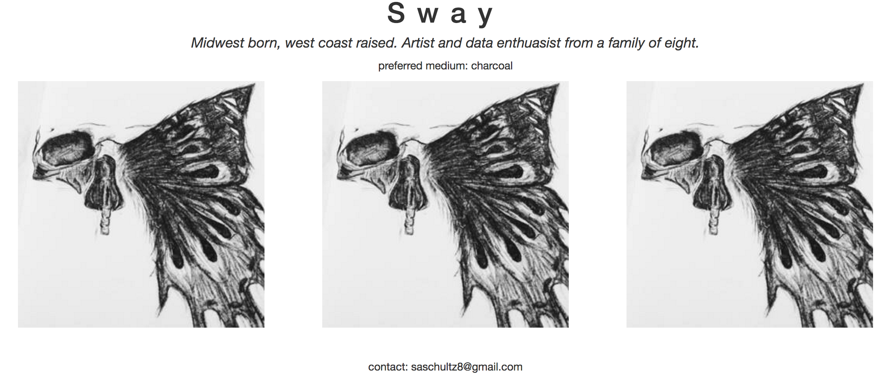

# ClubManager

This project was created for the last independent project of JavaScript course at Epicodus. This application was created for an art club manager to track the members of the club, and for the other members to learn about the club and who participates. The admin of the site can add new members, update existing members, and delete members.

## member profile

This project was generated with [Angular CLI](https://github.com/angular/angular-cli) version 1.0.0.

### Setup/Installation Requirements
* clone https://github.com/saschultz/zoo-tracker.git
* cd club-manager
* run this series of commands:
  * `$ npm install`
  * `$ bower install`
  * `$ npm install angularfire2@4.0.0-rc.0 firebase --save`

Then create your firebase API credentials
* log in to FireBase https://firebase.google.com/
* select 'Add firebase to your web app' to generate API Key credentials
* change data rules for .read and .write to 'true'
* run command:
  * `$ touch src/app/api-keys.ts`
  * write:
      export var masterFirebaseConfig = {
        apiKey: "Your API info",
        authDomain: "Your API info",
        databaseURL: "Your API info",
        projectId: "Your API info",
        storageBucket: "Your API info",
        messagingSenderId: "Your API info"
      };  
Finally!
  * `$ gulp build`
  * `$ gulp serve`

## Development server

Run `ng serve` for a dev server. Navigate to `http://localhost:4200/`. The app will automatically reload if you change any of the source files.

## Further help

To get more help on the Angular CLI use `ng help` or go check out the [Angular CLI README](https://github.com/angular/angular-cli/blob/master/README.md)
.

### Known Bugs
No known bugs or issues here!

### Technologies Used
* JavaScript, TypeScript
* HTML, CSS
* Angular JS

### By Authors
Sara Schultz

### Support and contact details
For questions/support contact Sara: saschultz8@gmail.com

### License
_MIT_ &copy; _2017_ **Sara Schultz**
