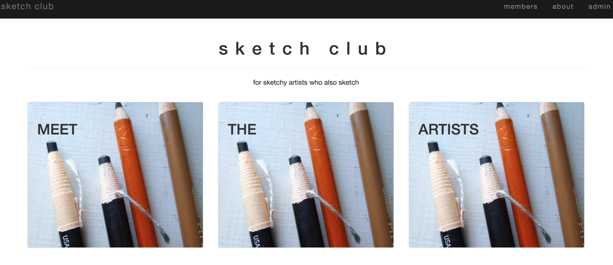

# ClubManager

This project was generated with [Angular CLI](https://github.com/angular/angular-cli) version 1.0.0.

## Development server

Run `ng serve` for a dev server. Navigate to `http://localhost:4200/`. The app will automatically reload if you change any of the source files.

### Setup/Installation Requirements
* clone https://github.com/saschultz/zoo-tracker.git
* cd club-manager
* run this series of commands:
  * `$ npm install`
  * `$ bower install`
  * `$ gulp build`
  * `$ gulp serve`

## Further help

To get more help on the Angular CLI use `ng help` or go check out the [Angular CLI README](https://github.com/angular/angular-cli/blob/master/README.md).
